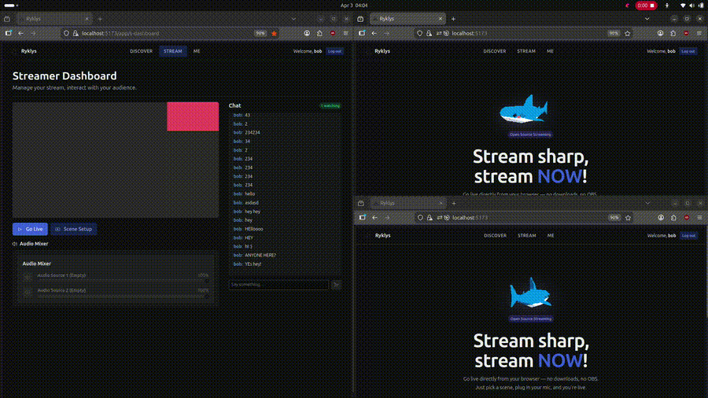

# Ryklys

**A live streaming platform built from scratch - no frameworks, no shortcuts.**



Stream directly from your browser to an audience in real time. No OBS, no downloads. Just open Ryklys, go live, and your viewers are watching within seconds.

<!-- Replace these with your actual screenshots/demo -->
<!--  -->
<!--  -->
<!--  -->

## What makes this different

The entire backend — HTTP server, WebSocket handler, connection pool, stream pipeline — is **written from scratch in C++** using raw Linux sockets and epoll. The frontend captures your camera/screen via WebRTC, sends it to the backend, which pipes it through FFmpeg into HLS segments and delivers them to viewers. Chat runs over Redis Pub/Sub across multiple nodes.

The custom HTTP server parses requests, routes them, handles CORS, manages cookies, and upgrades WebSocket connections — all custom. The connection pool, thread pool, JWT auth, and service locator are all hand-rolled.

## Architecture

```
Browser (Streamer)                        Browser (Viewer)
     │                                         ▲
     │ WebRTC                                  │ HLS
     ▼                                         │
┌─────────────────────────────────────────────────────┐
│                      Caddy                          │
│              (reverse proxy / TLS)                  │
└────────────┬────────────────────────┬───────────────┘
             │                        │
     ┌───────▼───────┐       ┌───────▼───────┐
     │   Backend A   │       │   Backend B   │
     │   (C++ / :3001)│       │   (C++ / :3002)│
     └───┬───┬───┬───┘       └───┬───┬───┬───┘
         │   │   │               │   │   │
         │   │   └──────┬────────┘   │   │
         │   │          │            │   │
    ┌────▼┐ ┌▼─────┐ ┌─▼──────┐ ┌──▼─┐ │
    │FFmpeg│ │Redis │ │PostgreSQL│ │FFmpeg│
    │     │ │Pub/Sub│ │        │ │     │ │
    └──┬──┘ └──────┘ └────────┘ └──┬──┘ │
       │                           │     │
       ▼                           ▼     │
  ┌──────────────────────────────────┐   │
  │         StreamPocket             │◄──┘
  │   (HLS segment storage / :7070) │
  └──────────────────────────────────┘
```

## Tech Stack

**All built from scratch (no frameworks):**
- Custom HTTP/1.1 server with epoll (edge-triggered) and thread pool
- WebSocket protocol implementation (handshake, framing, masking)
- Connection pooling for PostgreSQL and Redis
- JWT authentication (create, verify, cookie management)
- CORS middleware
- Service locator pattern for dependency injection
- StreamPocket — a custom HLS segment storage and delivery server

**Infrastructure:**
- C++17 backend on Linux
- React + TypeScript + Vite frontend
- PostgreSQL for users and stream metadata
- Redis for pub/sub chat, viewer tracking, and multi-node coordination
- FFmpeg for WebRTC → HLS transcoding
- Caddy for reverse proxy and load balancing
- Docker + Docker Compose

## Features

- **Browser-native streaming** — go live with your webcam or screen share, no software to install
- **Real-time HLS delivery** — sub-5-second latency from streamer to viewer
- **Live chat** — Redis pub/sub powered, works across multiple backend nodes
- **Viewer count tracking** — real-time, broadcast to all connected viewers
- **Multi-node ready** — stateless backend design with Caddy load balancing and Redis coordination
- **User authentication** — register, login, JWT sessions via HttpOnly cookies
- **Stream history** — browse your past streams with duration and metadata
- **Stream browsing** — discover who's live and jump into any stream

## Project Structure

```
ryklys/
├── backend/
│   ├── main.cpp                    # Entry point — epoll loop, server bootstrap
│   ├── zvejys-rest-api/            # Custom HTTP server core
│   │   ├── ZvejysServer.h          # Server, routing, WebSocket upgrade
│   │   ├── HttpConnection.h        # Request parsing, response writing
│   │   └── utils/                  # JWT, password hashing, validation
│   ├── routes/                     # Route handlers
│   │   ├── user-route/             # Register, login, profile
│   │   ├── stream-route/           # Go live, stream management
│   │   └── viewer-route/           # Viewer WebSocket, chat
│   ├── services/                   # ChatRelay, RedisClient, ViewerRegistry
│   ├── database/                   # PostgreSQL repositories
│   ├── stream-pocket/              # HLS segment storage server
│   ├── pg-connection-pool/         # Custom PostgreSQL connection pool
│   ├── include/                    # Thread pool, external headers
│   ├── CMakeLists.txt
│   ├── Dockerfile
│   └── Caddyfile
├── frontend/
│   ├── src/
│   │   ├── pages/                  # Landing, browse, stream view, dashboard
│   │   ├── components/             # Navbar, UI components
│   │   ├── hooks/                  # Auth context, custom hooks
│   │   └── config/                 # Environment, paths
│   ├── package.json
│   └── vite.config.ts
├── docker-compose.yml
└── README.md
```

## Running Locally

**Prerequisites:** C++17 compiler, CMake, Node.js 18+, PostgreSQL, Redis, FFmpeg

**Backend:**
```bash
cd backend
cp .env.example .env          # configure your DB and Redis connection
cmake -B build && cmake --build build
./build/ryklys_backend
```

**Frontend:**
```bash
cd frontend
npm install
npm run dev
```

**With Docker:**
```bash
docker-compose up
```

**Multi-node (with Caddy):**
```bash
cd backend
SERVER_PORT=3001 ./build/ryklys_backend &
SERVER_PORT=3002 ./build/ryklys_backend &
caddy run --config Caddyfile
```

## Roadmap

- [ ] HTTPS everywhere (Caddy + Let's Encrypt)
- [ ] FFmpeg process watchdog
- [ ] Stream thumbnails for the browse page
- [ ] VOD — keep segments after stream ends
- [ ] Follow system and channel pages
- [ ] Stream categories and tags
- [ ] Clip system
- [ ] Adaptive bitrate (multiple quality options)
- [ ] CDN for segment delivery at scale

## Author

**TheMixas** — [github.com/TheMixas](https://github.com/TheMixas)

Built as a deep dive into systems programming, networking, and real-time media delivery.
